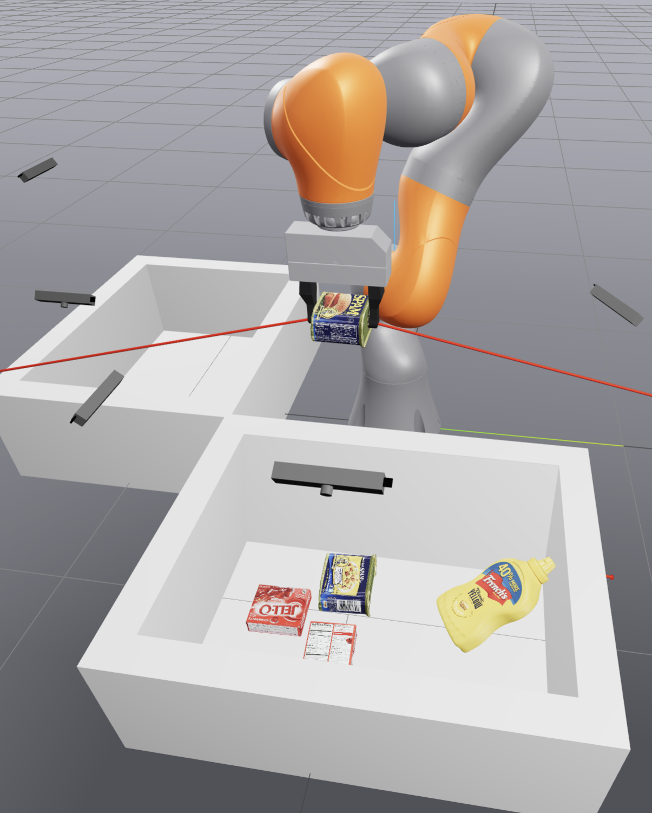

# Clutter Clearing
Robot Kuka LBR iiwa pick and place all objects from one box into another using point clouds and state machine

## Running
- `uv run python src/main.py --num-object <number> --seed <seed>` - run clutter clearing with any number of YCB objects and on any seed

## Results


## Getting Started

### Installation
This project uses `uv` for dependency management. Clone the parent repository and navigate to the project directory:

```bash
git clone https://github.com/KajetanFrackowiak/MiniProjectsRobotics.git
cd MiniProjectsComputerRobotics/clutter_clearing
uv sync
