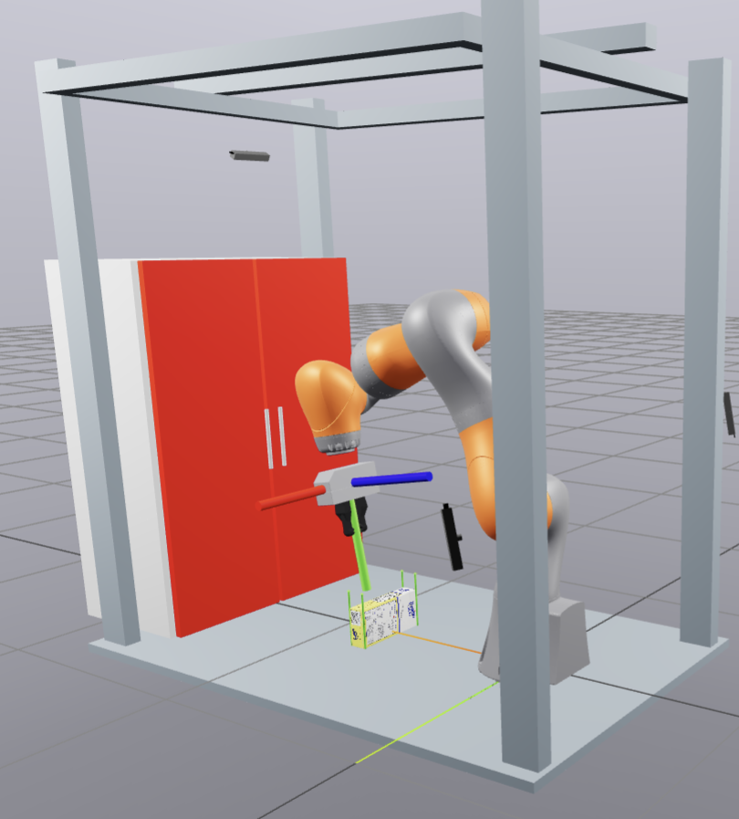
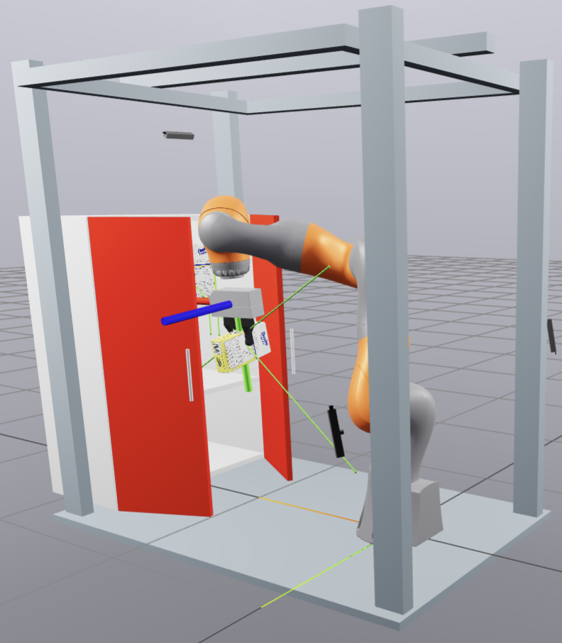

# Pick and Place Door Opening
Robot (Kuka IIWA) opens the cupboard's left and right doors, then picks the sugar box from the floor and places it on the shelf.

## Problem
During placing, the robot rubs against the door and the object slips out.

## Running
- `uv run python src/main.py --visualize-traj` — visualize trajectory
- `uv run python src/main.py --run-ik` — solve IK + simulate
- `uv run python src/main.py --run-teleop-ik` — teleop IK

## Results
 