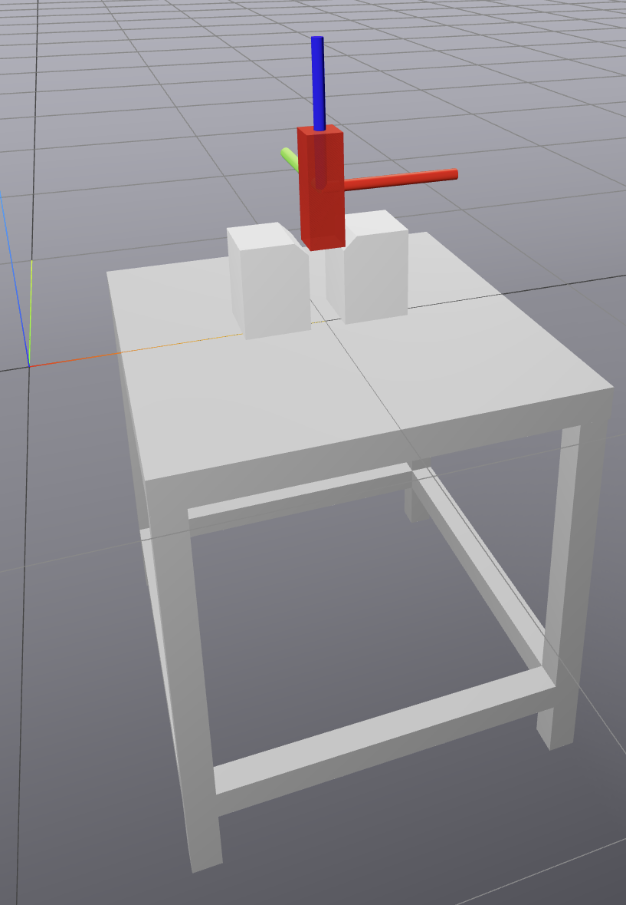
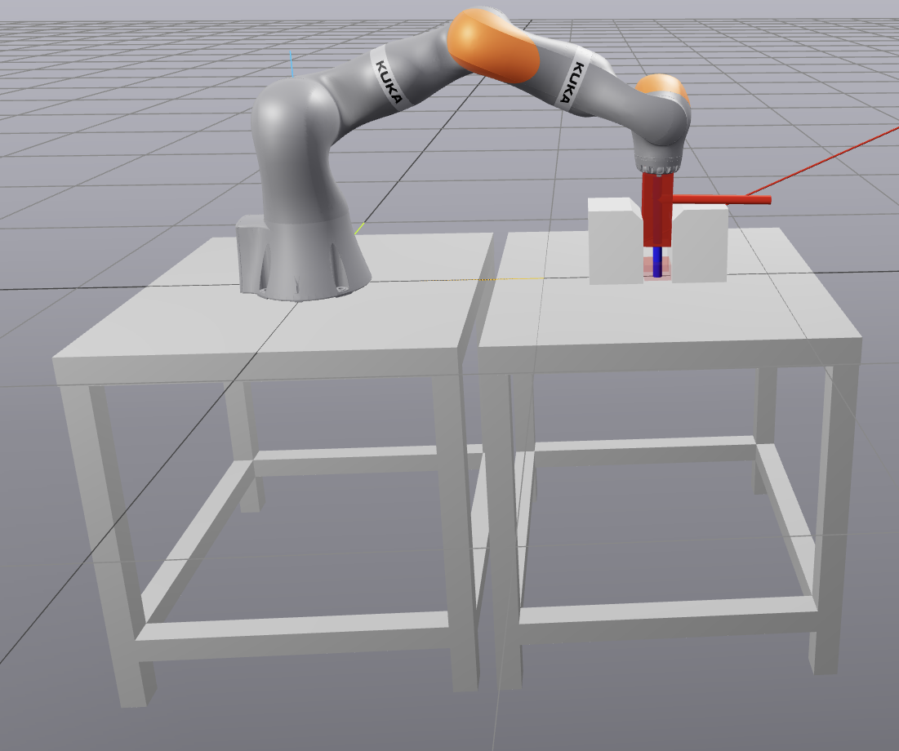

# Peg in a Hole
Robot Kuka IIWA and planar manipulator insert a peg into a hole using impedance control.

## Running
- `uv run python src/main.py --sim planar` — run planar peg in a hole
- `uv run python src/main.py --sim iiwa` — run Kuka IIWA peg in a hole

## Results



## Getting Started

### Installation
This project uses `uv` for dependency management. Clone the parent repository and navigate to the project directory:

```bash
git clone https://github.com/KajetanFrackowiak/MiniProjectsRobotics.git
cd MiniProjectsComputerRobotics/peg_in_a_hole
uv sync
